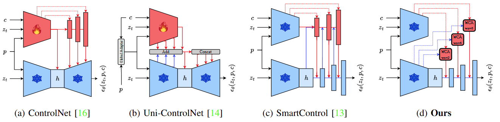
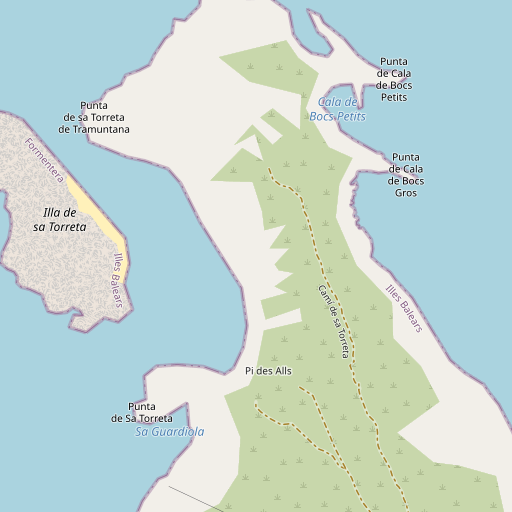
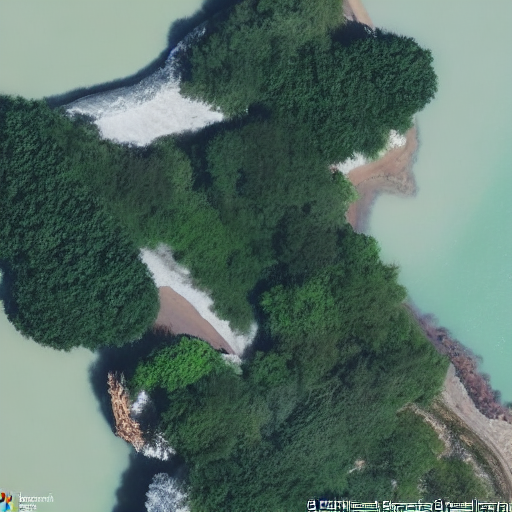
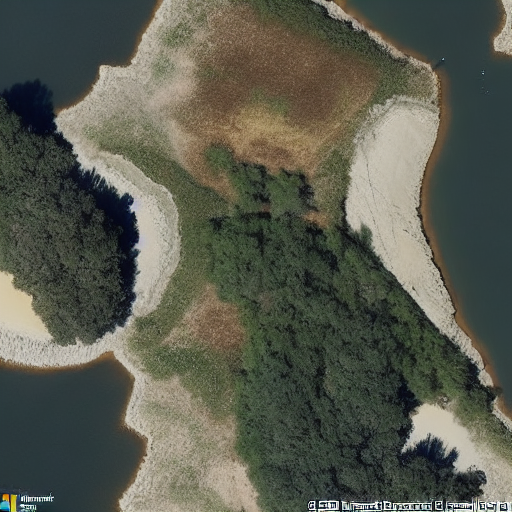
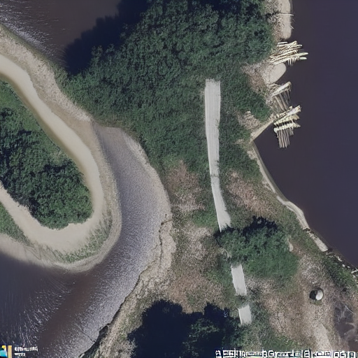

# Efficient Geometry-Controlled High-Resolution Satellite Image Synthesis

This repo contains the inference pipeline for the satellite synthesis models introduced in 
> [Efficient Geometry-Controlled High-Resolution Satellite Image Synthesis](), IGARSS 2026



Source code and model checkpoint are stored on 🤗HuggingFace, at [Vladimirescu/SatSynthWCA](Vladimirescu/SatSynthWCA).

Inference can be simply performed through one of the following two options:

1. Specify the desired `<latitude>` and `<longitude>` of the location you wish to import geometry from:
```python
python infer_HF.py --hf_repo Vladimirescu/SatSynthWCA --lat <latitude> --lon <longitude> --prompt <text_prompt>
```
which will download the corresponding $512\times 512$ geometry tile from [OpenStreetMap](https://www.openstreetmap.org/) (OSM) API at the given coordinates, and will use it as a conditioning signal for the generative process.

2. Specify a location for the OSM tile on your device you wish to use:
```python
python infer_HF.py --hf_repo Vladimirescu/SatSynthWCA --osm_map <path_to_OSM_image> --prompt <text_prompt>
```
which will ignore any default/non-default values given to `lat`/`lon`.

In both cases the generated satellite image and the OSM tile will be stored locally at `generated.png` and `osm_map.png`, respectively.

---
### Example:
The following command:
```python
python infer_HF.py --hf_repo Vladimirescu/SatSynthWCA
                   --lat 38.788568
                   --lon 1.424129
                   --prompt "An island surrounded by water, with a forest in the middle and a dirt road going through it."
```
produces the following result(s):
<table style="table-layout: fixed;">
  <tr>
   <td align="center" width="25%">
      <b>OSM control</b>
      
    </td>
   <td align="center" width="25%">
      <b><code>prompt</code></b>
      
    </td>
   <td align="center" width="25%">
      <b><code>prompt + "drought"</code></b>
      
    </td>
   <td align="center" width="25%">
      <b> <code>prompt + "hurricane"</code></b>
      
    </td>
  </tr>
</table>
